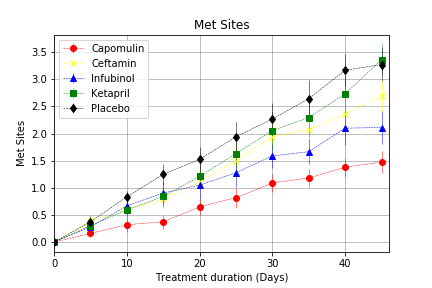
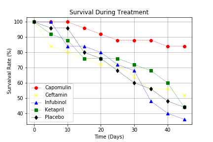
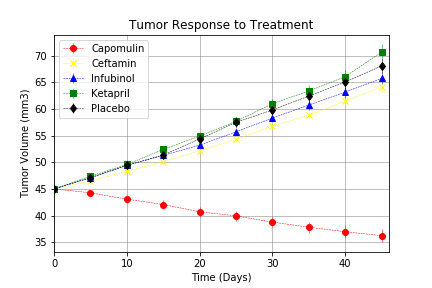
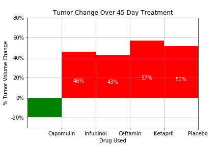

# MatPlot
### Summary
This repository contains a Jupyter Notebook with the viewable Data Frames and a written description of observable trends based on the most recent animal study in Pymaceuticals Inc. based out of San Diego, CA.
### Technical Details
In order to run the code, it is required the Matplotlib library, pandas library and Jupyter Notebook. 
### Screenshots
MetastaticResponseToTreatment.png 
  
SurvivalRates.png 
  
TumorResponseTotreatment.png 
  
TumorVolumeChange.png 
  
### Explanations 
The outcome is shown in screenshots for reference purpose of the public. 

## Option 2: Pymaceuticals Inc
Pymaceuticals Inc. is a burgeoning pharmaceutical company based out of San Diego, CA.
Pymaceuticals specializes in drug-based, anti-cancer pharmaceuticals. 
In their most recent efforts, they've since begun screening for potential treatments to squamous cell carcinoma (SCC), a commonly occurring form of skin cancer.

Given access to the complete data from their most recent animal study. 
In this study, 250 mice were treated through a variety of drug regimes over the course of 45 days. 
Their physiological responses were then monitored over the course of that time. 
Analyze the data to show how four treatments (Capomulin, Infubinol, Ketapril, and Placebo) compare.

* Create a scatter plot that shows how the tumor volume changes over time for each treatment.
* Create a scatter plot that shows how the number of [metastatic](https://en.wikipedia.org/wiki/Metastasis) (cancer spreading) sites changes over time for each treatment.
* Create a scatter plot that shows the number of mice still alive through the course of treatment (Survival Rate)
* Create a bar graph that compares the total % tumor volume change for each drug across the full 45 days.

As final considerations:

* Use the Pandas Library and the Jupyter Notebook, the Matplotlib library.
* Include a written description of three observable trends based on the data.

* Use proper labeling of your plots, including aspects like: Plot Titles, Axes Labels, Legend Labels, X and Y Axis Limits, etc.
* Include [error bars](https://en.wikipedia.org/wiki/Error_bar). This will allow the company to account for variability between mice. 
* Look into [`pandas.DataFrame.sem`](http://pandas.pydata.org/pandas-docs/stable/generated/pandas.DataFrame.sem.html) for ideas on how to calculate this.
* Remember when making your plots to consider aesthetics!
  * Legends are not be overlaid on top of any data.
  * Graphs indicate tumor growth as red and tumor reduction as green.
    It should also include a label with the percentage change for each bar. You may want to consult this [tutorial](http://composition.al/blog/2015/11/29/a-better-way-to-add-labels-to-bar-charts-with-matplotlib/) for relevant code snippets.
* See [Starter Workbook](pymaceuticals_starter_Final.ipynb) for a reference on expected format. (Note: For this example, you are not required to match the tables or data frames included. Your only goal is to build the scatter plots and bar graphs. Consider the tables to be potential clues, but feel free to approach this problem, however, you like.)

## Hints and Considerations

* Trudge through these problems.no shame in fumbling along the way. 

* Do not get bogged down in trying to interpret and accomplish each step.

